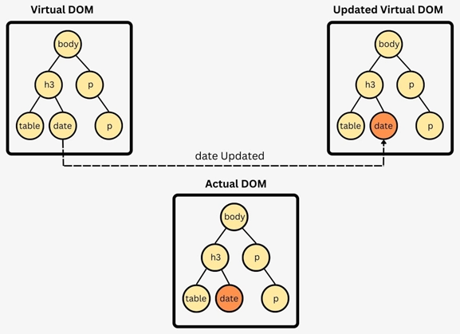

# Formation React

_6H - Yoann Eichelberger_

---

## Objectifs

- Comprendre et maitriser le paradigme de React.
- Être capable de développer sa propre application React **sans dépendances**.

---

## Plan

1. Introduction à React
2. Atelier : codons un Pokedex
3. Exercice : développe ton jeu pokemon

---

# React (aka React.JS)

---

## C'est quoi ?

- créé en 2013
- maintenu par **Meta** et sa communuté.
- une **bibliothèque javascript**.
- permet de manipuler un DOM Virtuel.

---

## Comment ça marche ?

- Injecte dans du HTML un DOM Virtuel
- Compare ce DOM Virtuel avec le DOM.
- Si le DOM Virtuel change, React applique les changements au DOM atomatiquement.

---

---

# Atelier !

- VSCode
- NodeJS
