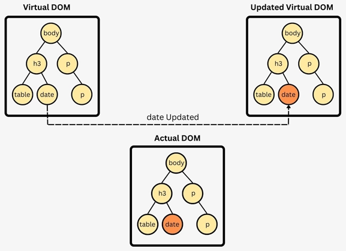

# Formation React

_6H - Yoann Eichelberger_

---

## Objectifs

- Comprendre et maitriser le paradigme de React.
- Être capable de développer sa propre application React **sans dépendances**.

---

## Plan

1. Introduction à React
2. Atelier : codons un Pokedex
3. Exercice : développe ton jeu pokemon

---

# React (aka React.JS)

---

## C'est quoi ?

- créé en 2013
- maintenu par **Meta** et sa communuté.
- une **bibliothèque javascript**.
- permet de manipuler un DOM Virtuel.

---

## Comment ça marche ?



---

# JSX / TSX Kezako ?

---

## Code JS

```ts
React.createElement(
  "div",
  undefined,
  React.createElement("h1", undefined, "Yoann Eichelberger"),
  React.createElement(
    "p",
    undefined,
    "Je suis ",
    React.createElement(
      "span",
      { style: { backgroundColor: "red" } },
      "développeur"
    ),
    "."
  )
);
```

---

## Code JSX

```tsx
<div>
  <h1>Yoann Eichelberger</h1>
  <p>
    Je suis <span style={{ backgroundColor: "red" }}>développeur</span>.
  </p>
</div>
```

---

# Atelier !

- VSCode
- NodeJS
